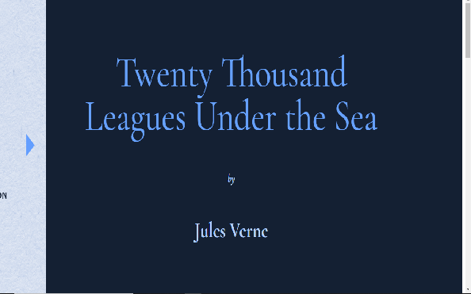

# 20,000 Leagues Under The Sea

> Online reader web page.

## Table of contents

- [General info](#general-info)
- [Screenshots](#screenshots)
- [Technologies](#technologies)
- [Features](#features)
- [Status](#status)
- [Inspiration](#inspiration)
- [Contact](#contact)

## General info

An online reader web page that represent the book "20,000 Leagues under the sea" by Jules Verne.

## Screenshots

## Technologies

- HTML5
- CSS3
- JavaScript

## Features

List of features ready and TODOs for future development

- Shows Table of content by hovering over the left side bar.
- Hover over highlighted words to show the definition.
- Semi transparent button when hovered will turn opaque.

To-do list:

- Transition Text Feature
- Animayion of "Next" and "Back" button
- Side bar slide out

## Status

Project is in progress.

## Inspiration

This is a Codecademy project showing the transition CSS.

## Contact

Created by [@gideon](https://www.linkedin.com/in/gideon-flores-8b598417a?lipi=urn%3Ali%3Apage%3Ad_flagship3_profile_view_base_contact_details%3BuhgnqtY%2FS8OSLFKXjAIbKw%3D%3D)
